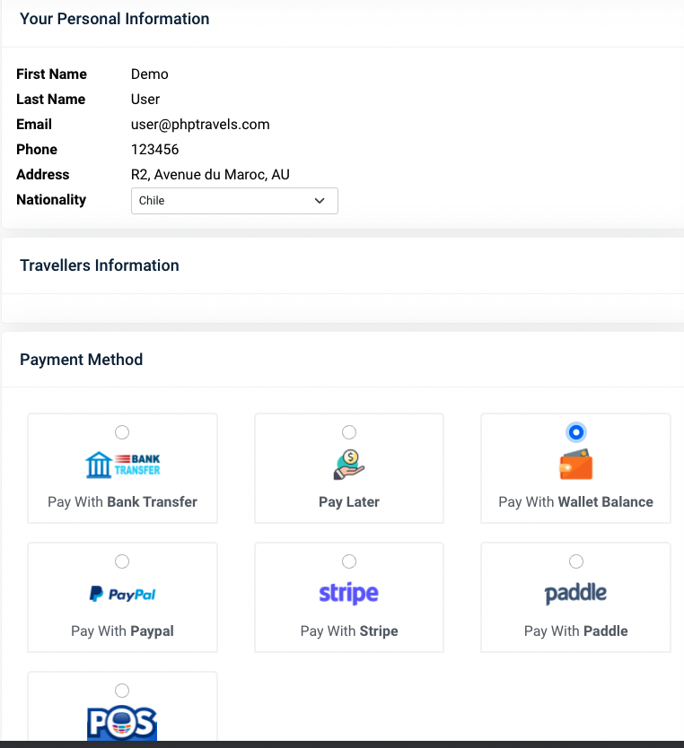
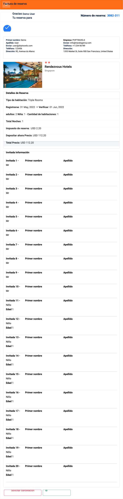
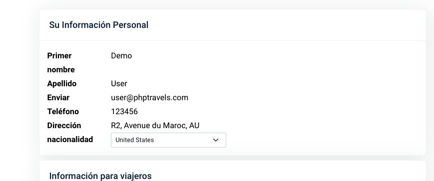
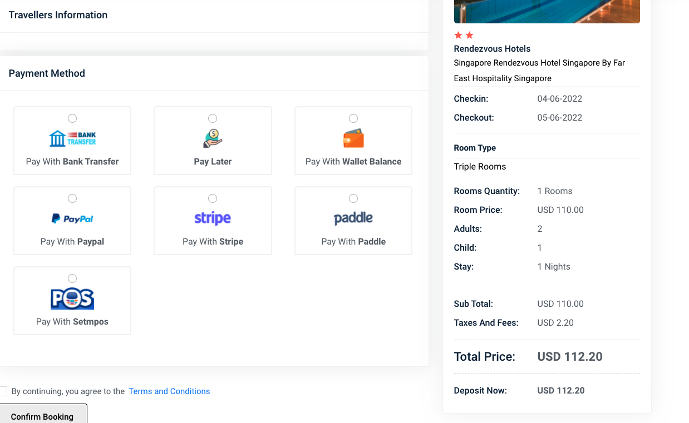
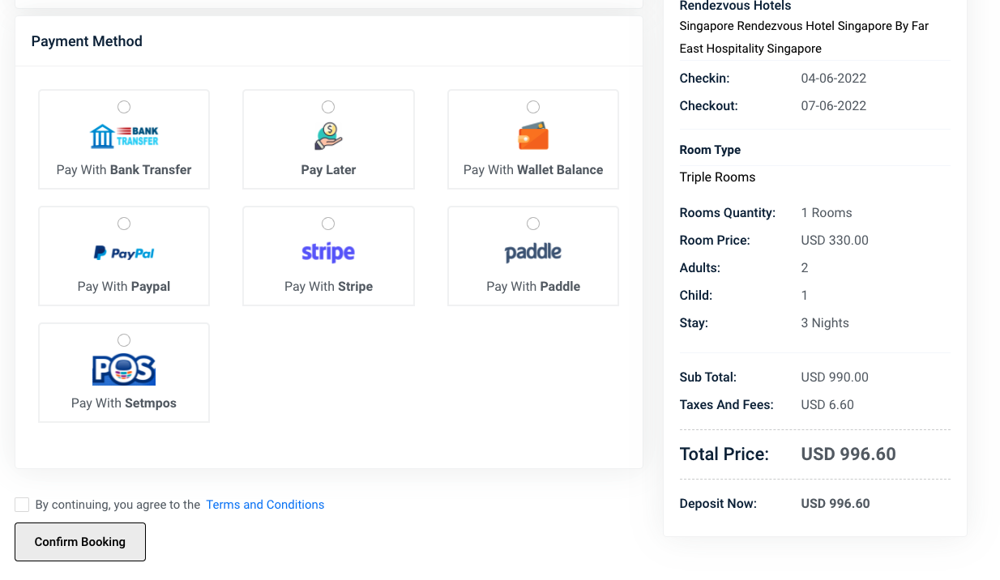
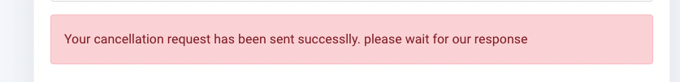

# Exploratory testing
## Goals
##### Booking a stay in a hotel

## Scenarios

### 1.- Booking flow successfully
- Exploration target: Booking a room
- Behavior expected, should be me allow to book a room successfully and see the reservation on my account.
- Bugs or improvements:
  - Bugs
    - the site allows making a booking without any guest, even paid the reservation
    - 
    - the site allows making a booking with more guests than the maxim capacity of the room
    - 
    - it's possible to make a booking with guest information empty
    - the nationality by default is United States, should be the option by default SELECT or even the user's nationality
    - 
    - it's possible to avoid put the nationality and select the option SELECT
  - Improvements: 
    - should be a nice to have adding a pet option when you configure the adults and childs guest before to booking
    - the fields regarding guest information should handle a validation and force the fields are required (First Name and Last Name) and don't allow creating reservations without guest information.
    - could be a nice to have an option to recommend the user in case have a large number of guests, to booking more rooms (adjusted to the total guest put it)

### 2.- Paid and vouchers
- Exploration target: Verify the values and description are correct
- Behavior expected: amounts, paid, taxes should be put correctly 
- Bugs or improvements:
    - Bugs
        - When you select more than one night, the value of the room is multiplied two times, increasing the cost of the room wrongly
        - 
        - 
        - You need to click the icon or radio button to select the paid method, the ui suggest all the button is able to select the paid method (change color)
        - in the hotel search, appears a value for the room minor than shown on the detail

### 3.- Booking cancellation
- Exploration target: Try to cancel a reservation
- Behavior expected, should be me allow to cancel a room successfully and see cancellation in my account
- Bugs or improvements:
    - Bugs:
        - when you cancel a reservation the message is misspelled (successlly instead of successfully)
        - 
    - Improvements:
        - after the make a cancellation, should be a nice to have, handle a different state to describe the book is in a cancellation process    

## Approach
The approach I take it was prioritizing the scenarios on function about the scenarios highly critics.
- First, I wanted to assure the user is able to make a booking and don't have any blocker issue to create a booking successfully, the goal of that is to be sure at least the main goal of the functionality works
- Second, validate values from amount, dates and if possible get any voucher after reservation
- And finally, validate if is possible to make a cancellation

## Final thoughts
Fairly sight, it's clearly an in develop version, for a happy path flow for one-night booking works fine, but when is selected for more than one night, the values are wrong.
On the other hand, the site doesn't handle very well when the user can put an uncommon number of the room, guests, or children, you can put a large amount of them without any validation in the frontend
Finally is highly recommended evaluate with the client the priority over the issues found and evaluate the improvements declared.
